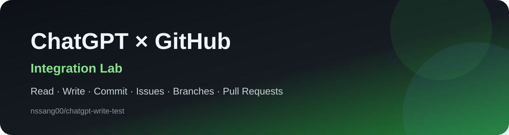

  

# ChatGPT GitHub Integration Lab

이 저장소는 **ChatGPT ↔ GitHub 연동 기능을 직접 검증하기 위한 테스트 공간**입니다.

현재까지 실제로 확인한 기능을 이 저장소에서 계속 실험하고 기록합니다.

## ✅ Verified capabilities

| Capability | Status | Notes |
|---|---:|---|
| Repository 읽기 | ✅ | 파일 및 메타데이터 조회 |
| 파일 생성 | ✅ | 새 파일 작성 가능 |
| 파일 수정 | ✅ | 기존 파일 업데이트 가능 |
| 파일 삭제 | ✅ | 기존 파일 삭제 가능 |
| Commit 생성 | ✅ | GitHub Contents API 기반 커밋 |
| Push에 해당하는 원격 반영 | ✅ | 기본 브랜치에 직접 반영 가능 |
| Branch 생성 | ✅ | 새 브랜치 생성 가능 |
| Issue 조회 | ✅ | 열린 이슈 검색/조회 가능 |
| Issue 생성/수정 | ✅ | 제목, 본문, 상태 등 변경 가능 |
| PR 생성/수정 | ✅ | Pull Request 생성 및 메타데이터 수정 가능 |
| Repository 생성 | ❌ | 현재 연결 기능에서는 미지원 |
| Repository About 수정 | ❌ | description / homepage / topics 변경 액션 미지원 |

## 🧪 Demo artifacts

- `chatgpt-push-demo-2026-10-07.txt`  
  ChatGPT가 직접 생성하고 원격 저장소에 반영한 테스트 파일
- `assets/chatgpt-github-demo.svg`  
  저장소 랜딩 페이지용 배너

## 🎯 Purpose

이 저장소의 목적은 단순합니다.

> “ChatGPT가 GitHub에서 실제로 어디까지 읽고, 쓰고, 관리할 수 있는가?”

기능을 하나씩 실제 저장소에 적용해보면서 검증합니다.

## 🛠 Next experiments

- 브랜치 생성 후 파일 변경
- Pull Request 생성
- Issue에 댓글 작성
- 라벨 및 담당자 변경
- PR 리뷰 및 머지 가능 범위 확인
- GitHub Actions 조회 및 재실행 가능 범위 확인

---

  Built as a live capability test for ChatGPT + GitHub integration.

